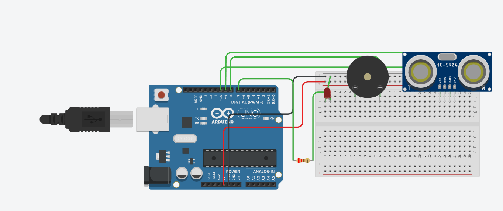
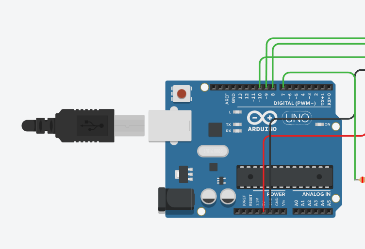

Intruder Alarm System
Security Project with Arduino and Ultrasonic Sensing

Project Overview
This project is an automated security alarm designed to detect movement. Using an HC-SR04 Ultrasonic Sensor, it monitors distance in real-time. When an object or intruder moves within the 30 cm threshold, the Arduino Uno triggers both a Red LED and a Piezo Buzzer as an alert.

1. Overall Circuit (Hackpad)
The breadboard layout is designed for maximum efficiency. I have placed the sensor at the edge of the board so its "eyes" have a clear field of view. All components share a common ground via the breadboard's negative rail.

2. Schematic Diagram
The schematic shows the logical flow of the circuit.

LED is connected to Digital Pin 7.

Buzzer is connected to Digital Pin 8.

Ultrasonic Sensor is connected to Pins 9 (Trig) and 10 (Echo).

A 220 ohm resistor is used to protect the LED from burning out.

3. PCB Layout
This is the view of the Printed Circuit Board. It shows the copper traces and component footprints as they would appear in a final, manufactured version of the device.

4. Case and Assembly
The 3D model shows how the project fits into its protective enclosure. The design includes specific cutouts for the ultrasonic sensor and the LED to ensure the device is functional while staying protected.

5. Bill of Materials (BOM)
This list includes all parts used in the project as exported from the CAD data:

Arduino Uno R3 (1 unit) - Main Controller

Ultrasonic Distance Sensor (HC-SR04) (1 unit) - Detects distance

Piezo Buzzer (1 unit) - Audible alarm

Red LED (1 unit) - Visual alert

Resistor (220 ohm) (1 unit) - LED protection

Breadboard (1 unit) - For circuit assembly

Jumper Wires (1 set) - For wiring connections

How the Logic Works
I wrote the code to constantly calculate distance using sound waves. When the sensor detects something closer than 30 cm, the Arduino sends power to the alarm pins. I used the tone() function for the buzzer to ensure it makes a clear sound during the simulation.